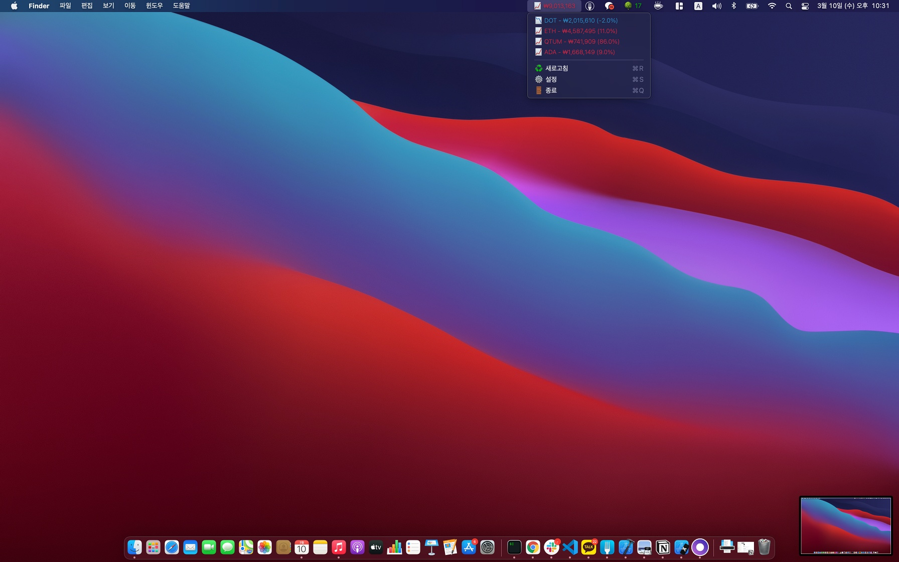

# upbitBar 

## 소개 🔍 

- 업비트 지갑 매번 스마트폰으로 확인하지 마시고 상태바에서 손쉽게 확인해보세요 💰
- Swift 5.0 으로 작성되었습니다.

## 미리보기 👀

- 설정을 하게되면 상태바에서 업비트 지갑의 잔액을 실시간으로 보실 수 있습니다. 
- 미리보기로 제공된 이미지는 예시입니다 

## 요구 사항 🪄

- `UpbitBar` 프로젝트는 Swift 5.0 으로 작성되었습니다.
- macOS 10.15 버전 이상에서 동작합니다.

## 사용한 라이브러리 📦

- [Just](https://github.com/dduan/Just) 
- [JWTComponents](https://github.com/couchdeveloper/JWTComponents) 
- [LaunchAtLogin](https://github.com/sindresorhus/LaunchAtLogin)
- [SnapKit](https://github.com/SnapKit/SnapKit)
- [Then](https://github.com/devxoul/Then)

## 설치하기 🎉 

### AppStore

## 이 프로젝트가 유용하셨나요 ? ❤️

저의 프로젝트가 유용하셨다면 [stargazers](https://github.com/techinpark/Jandi/stargazers) 에 동참해주세요 ⭐  
[팔로우](https://github.com/techinpark) 해주신다면 새로운 프로젝트를 더 빠르게 만나보실 수 있습니다  🤩

## Author 
- [techinpark](https://twitter.com/techinpark)

## 기여하기 🌱
모든 형태의 기여를 기다리고 있습니다  오타 수정, 기능 추가, 기능제안 모두 두팔벌려 환영합니다  🥳

## License 
`UpbitBar` is available under the MIT license. See the LICENSE file for more info.

